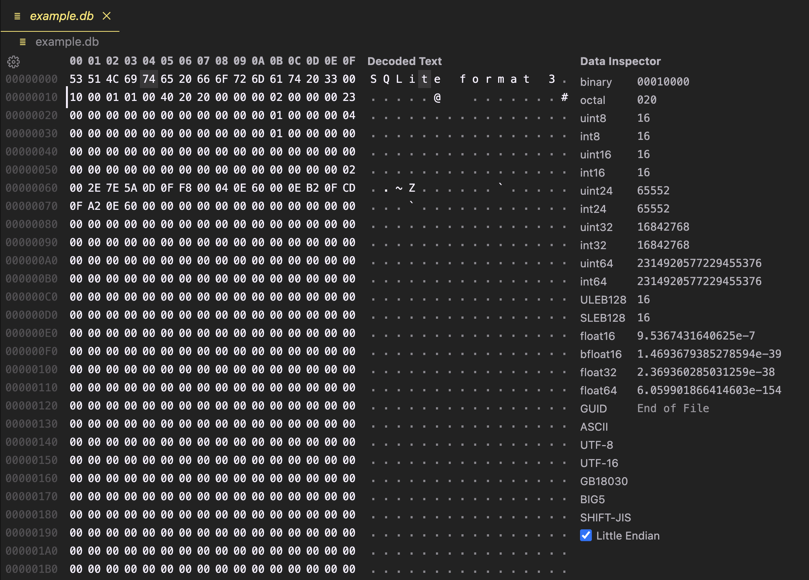

```sql
CREATE TABLE users (
    id INTEGER PRIMARY KEY AUTOINCREMENT,
    username TEXT NOT NULL UNIQUE,
    email TEXT NOT NULL UNIQUE,
    password_hash TEXT NOT NULL,
    created_at DATETIME DEFAULT CURRENT_TIMESTAMP
);
```

{/* Why is the page size so small here? If I'm reading VS Code right 

It seems like it's a page size of 16, but from https://www.sqlite.org/fileformat.html#the_database_header:

>  The database page size in bytes. Must be a power of two between 512 and 32768 inclusive, or the value 1 representing a page size of 65536

which seems to rule out anything less than 512...

```txt
00000000  5c 78 35 33 5c 78 35 31  5c 78 34 63 5c 78 36 39  |\x53\x51\x4c\x69|
00000010  5c 78 37 34 5c 78 36 35  5c 78 32 30 5c 78 36 36  |\x74\x65\x20\x66|
00000020  5c 78 36 66 5c 78 37 32  5c 78 36 64 5c 78 36 31  |\x6f\x72\x6d\x61|
00000030  5c 78 37 34 5c 78 32 30  5c 78 33 33 5c 78 30 30  |\x74\x20\x33\x00|
00000040  5c 78 31 30 5c 78 30 30  5c 78 30 31 5c 78 30 31  |\x10\x00\x01\x01|
00000050  5c 78 30 30 5c 78 34 30  5c 78 32 30 5c 78 32 30  |\x00\x40\x20\x20|
00000060  5c 78 30 30 5c 78 30 30  5c 78 30 30 5c 78 30 32  |\x00\x00\x00\x02|
00000070  5c 78 30 30 5c 78 30 30  5c 78 30 30 5c 78 32 33  |\x00\x00\x00\x23|
00000080  5c 78 30 30 5c 78 30 30  5c 78 30 30 5c 78 30 30  |\x00\x00\x00\x00|
*
000000a0  5c 78 30 30 5c 78 30 30  5c 78 30 30 5c 78 30 31  |\x00\x00\x00\x01|
000000b0  5c 78 30 30 5c 78 30 30  5c 78 30 30 5c 78 30 34  |\x00\x00\x00\x04|
000000c0  5c 78 30 30 5c 78 30 30  5c 78 30 30 5c 78 30 30  |\x00\x00\x00\x00|
*
000000e0  5c 78 30 30 5c 78 30 30  5c 78 30 30 5c 78 30 31  |\x00\x00\x00\x01|
000000f0  5c 78 30 30 5c 78 30 30  5c 78 30 30 5c 78 30 30  |\x00\x00\x00\x00|
*
00000170  5c 78 30 30 5c 78 30 30  5c 78 30 30 5c 78 30 32  |\x00\x00\x00\x02|
00000180  5c 78 30 30 5c 78 32 65  5c 78 37 65 5c 78 35 61  |\x00\x2e\x7e\x5a|
00000190  5c 78 30 64 5c 78 30 66  5c 78 66 38 5c 78 30 30  |\x0d\x0f\xf8\x00|
000001a0  5c 78 30 34 5c 78 30 65  5c 78 36 30 5c 78 30 30  |\x04\x0e\x60\x00|
000001b0  5c 78 30 65 5c 78 62 32  5c 78 30 66 5c 78 63 64  |\x0e\xb2\x0f\xcd|
000001c0  5c 78 30 66 5c 78 61 32  5c 78 30 65 5c 78 36 30  |\x0f\xa2\x0e\x60|
000001d0  5c 78 30 30 5c 78 30 30  5c 78 30 30 5c 78 30 30  |\x00\x00\x00\x00|
```


Maybe it means `2^16 == 65536`?

 */}


import SqliteHeaderParser from "./read-sqlite-with-a-hex-editor/HeaderParser";

<SqliteHeaderParser client:load />

> https://www.sqlite.org/fileformat.html#the_database_header

# ROWID
TODO: mention what a row id is and how to convert it to the actual row we care about
B-tree pages
---
Each b-tree page has at most 1 parent b-tree page. A page with no parent is called the root, and the root + all its children (and their children) is a full b-tree. It's possible (and indeed common) for a single page to be the entire tree (i.e. a root and a leaf). A b-tree is identified uniquely by the page number of its root page.

There are 2 types of B-trees:

**Table b-tree**
- 64 bit signed integer key
- Data stored in leaves

**Index b-tree**
- Arbitrary keys
- No data stored at all

There is 1 table b-tree for each table in the database, and there is 1 index b-tree for each index in the database.

**Depth of a b-tree page**
The depth of a leaf b-tree (page?) is 1, and the depth of an interior b-tree (page?) is 1 + the max depth of its children. In a well formed DB, all children will have the same depth

Within either type of b-tree, there are 2 types of pages, interior and leaf pages

### Interior page
- contains K keys and K+1 pointers. A pointer is a 32-bit unsigned int page number of the child page
- With one tiny exception, 2 \<= K. The upper bound on K is the number of keys that will fit in one page (which depends on the page size, of course)
- For index b-trees, if a key is too large to fit in 1/4 of the space in a page, an overflow page is used. This never comes up for table b-trees since the uint keys there are never very large.
- Pointers & keys **logically** alternate, with a pointer on both ends
- Keys within one page are unique & sorted in ascending order **logically** left to right
	- For any key X, pointers to the left of X go to pages where all the keys are \<= X and pointers to the right go to pages where the keys are > X
- Each key and the pointer to its immediate left are combined into a **cell**. (the right most pointer at the very end of the page is a special case and not part of a cell)

### Leaf page
The docs haven't said anything about these yet...

# Table b-trees
Each entry in a table b-tree is a 64-bit signed integer key, and up to $2^{31} - 1$ bytes of arbitrary data. The key corresponds to the [rowid](https://www.sqlite.org/lang_createtable.html#rowid) of a row in the table (WITHOUT ROWID tables are a special case).

For entries in an interior page, the values are always pointers to a child page. All actual data in the table is contained in the leaf pages.

# Index b-trees
In an index b-tree, the entries contain just a key of up to $2^{31}-1$ bytes and no data.

# Finding a b-tree

Page 1 (i.e. the first page, since they're 1-indexed) of the database always contains the `sqlite_schema` table's table b-tree. This table contains the root page number for all the other tables and indexes in the database.

## Cells
Each entry in a b-tree is a "cell". A cell contains a payload, which is a variable length part. For an index b-tree, the key is arbitrary length so the payload is the key. Interior table b-tree pages have only arbitrary length parts (these cells always have just a 64 bit key + a pointer) so they don't have a payload. Table b-tree leaf pages contain arbitrary length content (the actual data in a row in the table), so that content is the payload.

If a cell gets too big it gets broken up into an overflow page, but this probably isn't really worth talking about.

## Structure of a b-tree page
Let `K` be the number of cells in the page

1. The file header (only found on page 1)
2. 8 or 12 byte page header (all fields big endian)
	1. 1 byte page type id
		1. 0x02 == interior index b-tree page
		2. 0x05 == interior table b-tree page
		3. 0x10 == leaf index b-tree page
		4. 0x0d == leaf table b-tree page
	2. 2 byte offset of the first freeblock on the page, or 0 if no freeblock exists
	3. 2 byte int, number of cells in the page (`K`)
	4. 2 byte offset for the cell content area
	5. 1 byte number of free bytes (fragmented) in the content area
	6. Only for interior b-tree pages, a 4 byte page number. This is the right most pointer that is handled weirdly and isn't part of a cell
3. cell pointer array
	1. A list of `K` 2-byte integer offsets to the cell contents. Arranged in order of keys, with the offset for the smallest key on the left and the largest key on the right
4. unallocated space
	1. Note that this is not a freeblock, it's its own thing
5. cell content area
	1. Sqlite tries to store the content for a cell as far toward the end of the page as possible
6. reserved region

### Freeblocks
Freeblocks are how unused space inside a b-tree page is organized. They are organized in a singly-linked list, in order of increasing offset. Inside a freeblock, the first 2 bytes are an int offset in the current page where the next freeblock is (or 0 if this is the last freeblock). The next 2 bytes are the size of the freeblock (including the header).

Because of this header structure, freeblocks require at least 4 bytes of space. If there's a gruop of 3 (or less) unused bytes in the cell content area they are called a **fragment**. In the page header there's a field for counting the amount of fragments. The number of fragments is always kept at or below 60 (so a total worst case of 180 unused bytes that aren't part of freeblocks).


### Defragmenting
If the number of fragments/freeblocks gets too high, sqlite will come through and reorganize the page to put all the free space together in the unallocated part of the page, and get rid of any freeblocks and/or fragments.


# varint
A varint is a static Huffman encoding of 64-bit twos-complement integers, between 1 and 9 bytes in length. I have no idea why I should care. Here's the info from the docs:
> A variable-length integer or "varint" is a static Huffman encoding of 64-bit twos-complement integers that uses less space for small positive values. A varint is between 1 and 9 bytes in length. The varint consists of either zero or more bytes which have the high-order bit set followed by a single byte with the high-order bit clear, or nine bytes, whichever is shorter. The lower seven bits of each of the first eight bytes and all 8 bits of the ninth byte are used to reconstruct the 64-bit twos-complement integer. Varints are big-endian: bits taken from the earlier byte of the varint are more significant than bits taken from the later bytes. 

## Structure of a cell

The structure of a cell depends on the type of btree page that the cell is in:

**Table b-tree interior**
1. 4-byte page left-child page number
2. varint key (rowid)


**Table b-tree leaf (holds the actual data)**
1. varint: number of bytes of the payload (inc overflow)
2. varint: rowid
3. payload up until the point that it overflows
4. 4 byte big endian page number for the first page of the overflow page list. Omitted if all the payload fits on the b-tree page (not sure if that means the payload for this cell fits, or the payload for all the cells on this page)

**Index b-tree interior cell**
1. 4 byte page number which is a pointer to the left child
2. varint total number of bytes of key payload (inc overflow)
3. portion of the payload that doesn't overflow
4. 4 byte page number of the fist page o the overflow page list (omitted in the same situation as the table b-tree leaf)

**Index b-tree leaf cell**
1. varint - total number of bytes of key payload (inc overflow)
2. Portion of the payload that doesn't overflow
3. 4 byte page number of the fist page o the overflow page list (omitted in the same situation as the table b-tree leaf)

# Schema layer

## Record format
1. header
	1. varint: size of the header in bytes (inc this value)
	2. For each column, a "serial type" number representing the datatype of that column. Described below
1. body


# In practice
Set r2 endianness:
```
e cfg.bigendian=true
```

Define page header struct:
```
 "td struct btreePageHeader {char typeId;short firstFreeblockOffset;short numCellsInPage;short cellContentAreaOffset;char fragmentedFreeBytes;unsigned int rightPtr;};"
```

Print a page header:
```
tp btreePageHeader
```

## The actual process
1. Skip past the file header
```
s +100
```
2. 