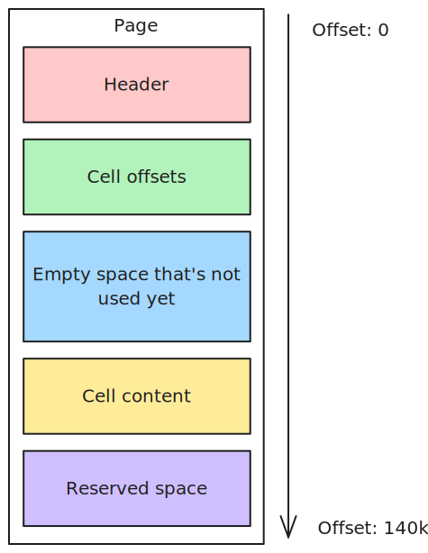

I recently wrote a sqlite file parser in python from scratch. I thought I'd write a blog post about
the things I learned along the way. I've chosen to keep things as simple as possible, as the goal isn't 
to write a production ready sqlite library (the stdlib already  has one), rather it's to gain a more
concrete understanding of how b-trees are implemented in real world databases.

## Creating a test database
Keeping the goal in mind, I decided to stick with a fairly database schema:

```sql
CREATE TABLE users (
    id INTEGER PRIMARY KEY AUTOINCREMENT,
    username TEXT NOT NULL UNIQUE,
    email TEXT NOT NULL UNIQUE,
    password_hash TEXT NOT NULL,
    created_at DATETIME DEFAULT CURRENT_TIMESTAMP
);
```

It's a pretty basic `users` table. Of note, however, is the `INTEGER PRIMARY KEY AUTOINCREMENT` column, and the 
two `UNIQUE columns` (the username & email). As we'll see, these two unassuming tweaks to the schema have some
pretty significant ramifications on performance for certain queries.

I also needed to bootstrap some data. Here's a script from chatgpt that handles creating the database and filling
in 1k test rows:
```python
import sqlite3

# Connect to SQLite database (or create it if it doesn't exist)
conn = sqlite3.connect("example.db")
cursor = conn.cursor()

# Create the users table if it doesn't exist
cursor.execute("""
CREATE TABLE IF NOT EXISTS users (
    id INTEGER PRIMARY KEY AUTOINCREMENT,
    username TEXT NOT NULL UNIQUE,
    email TEXT NOT NULL UNIQUE,
    password_hash TEXT NOT NULL,
    created_at DATETIME DEFAULT CURRENT_TIMESTAMP
)
""")

# Insert 1000 test users
users_to_insert = []
for i in range(1, 1001):
    username = f"user_{i}"
    email = f"user_{i}@example.com"
    password = f"password_{i}"  # Predictable test value for password
    users_to_insert.append((username, email, password))

# Use executemany for batch insertion
cursor.executemany("""
INSERT INTO users (username, email, password_hash)
VALUES (?, ?, ?)
""", users_to_insert)

# Commit changes and close connection
conn.commit()
conn.close()
```

The first challenge is reading a user based on the primary key. Basically the equivalent of:
```sql
SELECT * FROM users WHERE id = 450
```

## Overview
Before jumping into writing code, I think it'll make sense to have a high level understanding
of the process. The basic The basic steps to reading a record from a table are:

1. Parse the file header to figure out the page size
2. Read the `sqlite_schema` table to figure out what page the `users` starts on
3. (optional) If we're using an index rather than querying on the `rowid`, we'll use 
the index to look up the `rowid` for the record we need
4. Read the `users` table to find the record corresponding to our target `rowid`

Steps 2 and 4 are basically the same, as they're both just searching a table for a value.

### B-trees
I think the easiest way to learn how a b-tree works is with an example. Here's a (conceptual) diagram
of how our users table is stored:


Lets try to find user 5. First we go to the "root" of the tree. Each page in a sqlite database is
composed of cells. The cells are always sorted in ascending order based on their keys, which
allows us to do a binary search to efficiently look up cells based on their keys. For an interior
table page like this one, cells each contain a key and a pointer to another page. All the keys in the
child page (the one that's pointed to) are guaranteed to be less than or equal to the key in the cell.

So in our example, the smallest key that's \>= our target of 5 is 5, and it's got a pointer to page
8. This tells us that if we're looking for a row in the table with a rowid of 5, it'll either be in
page 8, or one of page 8's children (if page 8 turns out to to be another interior page).

In our case, page 8 is a leaf table page, so its cells contain the actual data for the table,
rather than just pointers to other pages. Once again, the cells are in order based on their key
so we can do another binary search to quickly find cell 5.

There's one last step necessary to parse the actual columns out of the cell's payload, but we'll get
to those implementation details a little later on.


## The File Header

Sqlite files (like so many file formats) start with a header. It's just a bunch of
**big endian** (very important!) fields, concatenated together. Here's a python class I
wrote that handles parsing the database header out of a file. ~~Here's a handy table
for reference, and a decoder. You can paste the first 100 (or more) bytes of a `sqlite.db` 
as hex into textbox, and it'll parse the fields out.~~

```python
@dataclass
class FileHeader:
    magic_bytes: bytes
    page_size: int
    format_write_version: int
    format_read_version: int
    reserved_bytes: int
    max_embedded_payload_frac: int
    min_embedded_payload_frac: int
    leaf_payload_frac: int
    file_change_counter: int
    file_size_pages: int
    freelist_trunk_ptr: int
    num_freelist_pgs: int
    schema_cookie: int
    schema_format_number: int
    default_page_cache_size: int
    largest_root_b_tree_ptr: int
    text_encoding: str
    user_version: int
    vacuum_mode: bool
    app_id: int
    version_valid_for: int
    sqlite_version_number: int

    def __init__(self, file: BinaryIO):
        (
            self.magic_bytes,
            self.page_size,
            self.format_write_version,
            self.format_read_version,
            self.reserved_bytes,
            self.max_embedded_payload_frac,
            self.min_embedded_payload_frac,
            self.leaf_payload_frac,
            self.file_change_counter,
            self.file_size_pages,
            self.freelist_trunk_ptr,
            self.num_freelist_pgs,
            self.schema_cookie,
            self.schema_format_number,
            self.default_page_cache_size,
            self.largest_root_b_tree_ptr,
            text_encoding,
            self.user_version,
            vacuum_mode,
            self.app_id,
            self.version_valid_for,
            self.sqlite_version_number,
        ) = struct.unpack(">16sH6B12i20x2i", file.read(100))
        self.text_encoding = {
            1: 'utf8',
            2: 'utf16-le',
            3: 'utf16-be'
        }[text_encoding]
        self.vacuum_mode = vacuum_mode != 0
```


{/*
import SqliteHeaderParser from "./read-sqlite-with-a-hex-editor/HeaderParser";

<SqliteHeaderParser client:only="react" />
*/}

Of major importance is the `pageSize` field. Pages are the highest level structure
in a sqlite file, so knowing how big they are is pretty useful. We'll skip the rest 
of the fields for now, but some of them will be coming up a little later.

## Sqlite page
Now that we know the page size, we need to parse the special `sqlite_schema` table. This is a
special table that gives us information about the other tables in the database. The first page
of the database file is always the root of the b-tree for this table, so it's very easy to find.

Conveniently for us, the example database I set up has only 1 table and a few indexes, so the entire
`sqlite_schema` table fits in one page. That means that the root page (i.e. page 1) is also a leaf
page, which means (for now) we only need to implement reading leaf table pages! Here's what that
implementation looks like:

```python
@dataclass
class BTreePage_TableLeaf(Page):
    cells: List[TableLeafCell]

    def __init__(self, file: BinaryIO, database: "Database"):
        self.offset = file.tell()
        if self.offset <= 100:
            self.offset = 0
        self.cells = []
        self.pageHeader = PageHeader(file)
				# This is an abstraction

        num_cells = self.pageHeader.numCellsInPage
        cell_ptrs = struct.unpack(f'>{num_cells}H', file.read(num_cells * 2))
        for ptr in cell_ptrs:
            file.seek(self.offset + ptr)
            self.cells.append(TableLeafCell(file, database.header.text_encoding))

    def get_record(self, row_id: int) -> Optional[Record]:
        idx = bisect_left(self.cells, row_id, key=lambda cell: cell.row_id)
        if idx < len(self.cells) and self.cells[idx].row_id == row_id:
            return self.cells[idx].record
        else:
            return None
```


My file has 35 pages, each 4096 ($2^{12}$) bytes in length, for a total of ~140Kb of data.
Here's a simplified diagram of the page layout:



This header is quite a bit shorter than the file-level one, only 8-12 bytes:


{/* > https://www.sqlite.org/fileformat.html#the_database_header

# ROWID
TODO: mention what a row id is and how to convert it to the actual row we care about
B-tree pages
---
Each b-tree page has at most 1 parent b-tree page. A page with no parent is called the root, and the root + all its children (and their children) is a full b-tree. It's possible (and indeed common) for a single page to be the entire tree (i.e. a root and a leaf). A b-tree is identified uniquely by the page number of its root page.

There are 2 types of B-trees:

**Table b-tree**
- 64 bit signed integer key
- Data stored in leaves

**Index b-tree**
- Arbitrary keys
- No data stored at all

There is 1 table b-tree for each table in the database, and there is 1 index b-tree for each index in the database.

**Depth of a b-tree page**
The depth of a leaf b-tree (page?) is 1, and the depth of an interior b-tree (page?) is 1 + the max depth of its children. In a well formed DB, all children will have the same depth

Within either type of b-tree, there are 2 types of pages, interior and leaf pages

### Interior page
- contains K keys and K+1 pointers. A pointer is a 32-bit unsigned int page number of the child page
- With one tiny exception, 2 \<= K. The upper bound on K is the number of keys that will fit in one page (which depends on the page size, of course)
- For index b-trees, if a key is too large to fit in 1/4 of the space in a page, an overflow page is used. This never comes up for table b-trees since the uint keys there are never very large.
- Pointers & keys **logically** alternate, with a pointer on both ends
- Keys within one page are unique & sorted in ascending order **logically** left to right
	- For any key X, pointers to the left of X go to pages where all the keys are \<= X and pointers to the right go to pages where the keys are > X
- Each key and the pointer to its immediate left are combined into a **cell**. (the right most pointer at the very end of the page is a special case and not part of a cell)

### Leaf page
The docs haven't said anything about these yet...

# Table b-trees
Each entry in a table b-tree is a 64-bit signed integer key, and up to $2^{31} - 1$ bytes of arbitrary data. The key corresponds to the [rowid](https://www.sqlite.org/lang_createtable.html#rowid) of a row in the table (WITHOUT ROWID tables are a special case).

For entries in an interior page, the values are always pointers to a child page. All actual data in the table is contained in the leaf pages.

# Index b-trees
In an index b-tree, the entries contain just a key of up to $2^{31}-1$ bytes and no data.

# Finding a b-tree

Page 1 (i.e. the first page, since they're 1-indexed) of the database always contains the `sqlite_schema` table's table b-tree. This table contains the root page number for all the other tables and indexes in the database.

## Cells
Each entry in a b-tree is a "cell". A cell contains a payload, which is a variable length part. For an index b-tree, the key is arbitrary length so the payload is the key. Interior table b-tree pages have only arbitrary length parts (these cells always have just a 64 bit key + a pointer) so they don't have a payload. Table b-tree leaf pages contain arbitrary length content (the actual data in a row in the table), so that content is the payload.

If a cell gets too big it gets broken up into an overflow page, but this probably isn't really worth talking about.

## Structure of a b-tree page
Let `K` be the number of cells in the page

1. The file header (only found on page 1)
2. 8 or 12 byte page header (all fields big endian)
	1. 1 byte page type id
		1. 0x02 == interior index b-tree page
		2. 0x05 == interior table b-tree page
		3. 0x10 == leaf index b-tree page
		4. 0x0d == leaf table b-tree page
	2. 2 byte offset of the first freeblock on the page, or 0 if no freeblock exists
	3. 2 byte int, number of cells in the page (`K`)
	4. 2 byte offset for the cell content area
	5. 1 byte number of free bytes (fragmented) in the content area
	6. Only for interior b-tree pages, a 4 byte page number. This is the right most pointer that is handled weirdly and isn't part of a cell
3. cell pointer array
	1. A list of `K` 2-byte integer offsets to the cell contents. Arranged in order of keys, with the offset for the smallest key on the left and the largest key on the right
4. unallocated space
	1. Note that this is not a freeblock, it's its own thing
5. cell content area
	1. Sqlite tries to store the content for a cell as far toward the end of the page as possible
6. reserved region

### Freeblocks
Freeblocks are how unused space inside a b-tree page is organized. They are organized in a singly-linked list, in order of increasing offset. Inside a freeblock, the first 2 bytes are an int offset in the current page where the next freeblock is (or 0 if this is the last freeblock). The next 2 bytes are the size of the freeblock (including the header).

Because of this header structure, freeblocks require at least 4 bytes of space. If there's a gruop of 3 (or less) unused bytes in the cell content area they are called a **fragment**. In the page header there's a field for counting the amount of fragments. The number of fragments is always kept at or below 60 (so a total worst case of 180 unused bytes that aren't part of freeblocks).


### Defragmenting
If the number of fragments/freeblocks gets too high, sqlite will come through and reorganize the page to put all the free space together in the unallocated part of the page, and get rid of any freeblocks and/or fragments.


# varint
A varint is a static Huffman encoding of 64-bit twos-complement integers, between 1 and 9 bytes in length. I have no idea why I should care. Here's the info from the docs:
> A variable-length integer or "varint" is a static Huffman encoding of 64-bit twos-complement integers that uses less space for small positive values. A varint is between 1 and 9 bytes in length. The varint consists of either zero or more bytes which have the high-order bit set followed by a single byte with the high-order bit clear, or nine bytes, whichever is shorter. The lower seven bits of each of the first eight bytes and all 8 bits of the ninth byte are used to reconstruct the 64-bit twos-complement integer. Varints are big-endian: bits taken from the earlier byte of the varint are more significant than bits taken from the later bytes. 

## Structure of a cell

The structure of a cell depends on the type of btree page that the cell is in:

**Table b-tree interior**
1. 4-byte page left-child page number
2. varint key (rowid)


**Table b-tree leaf (holds the actual data)**
1. varint: number of bytes of the payload (inc overflow)
2. varint: rowid
3. payload up until the point that it overflows
4. 4 byte big endian page number for the first page of the overflow page list. Omitted if all the payload fits on the b-tree page (not sure if that means the payload for this cell fits, or the payload for all the cells on this page)

**Index b-tree interior cell**
1. 4 byte page number which is a pointer to the left child
2. varint total number of bytes of key payload (inc overflow)
3. portion of the payload that doesn't overflow
4. 4 byte page number of the fist page o the overflow page list (omitted in the same situation as the table b-tree leaf)

**Index b-tree leaf cell**
1. varint - total number of bytes of key payload (inc overflow)
2. Portion of the payload that doesn't overflow
3. 4 byte page number of the fist page o the overflow page list (omitted in the same situation as the table b-tree leaf)

# Schema layer

## Record format
1. header
	1. varint: size of the header in bytes (inc this value)
	2. For each column, a "serial type" number representing the datatype of that column. Described below
1. body


# In practice
Set r2 endianness:
```
e cfg.bigendian=true
```

Define page header struct:
```
 "td struct btreePageHeader {char typeId;short firstFreeblockOffset;short numCellsInPage;short cellContentAreaOffset;char fragmentedFreeBytes;unsigned int rightPtr;};"
```

Print a page header:
```
tp btreePageHeader
```

## The actual process
1. Skip past the file header
```
s +100
```
2.  */}