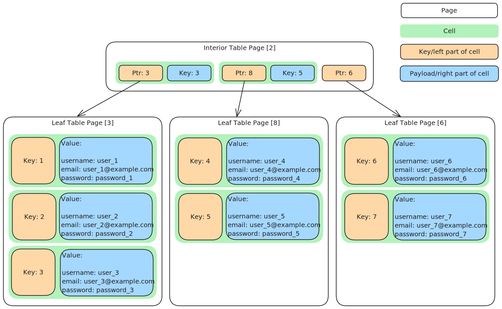
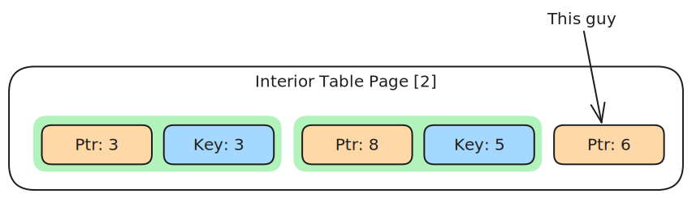

I recently wrote a sqlite file parser in python from scratch to learn more about SQLite's internals. I just
started this blog, so I figured it would be fun to write everything up in a blogpost! I've chosen to keep
things as simple as possible, as my goal isn't to write a production-ready sqlite library (the stdlib
already has one), rather it's to gain a more concrete understanding of how b-trees are implemented in practice.

All the code from this project is available in [this github repo](https://github.com/B1tWhys/sqlite-parser/blob/main/parse_database.py).

## Creating a test database

Keeping the goal in mind, I decided to stick with a fairly database schema:

```sql
CREATE TABLE users (
    id INTEGER PRIMARY KEY AUTOINCREMENT,
    username TEXT NOT NULL UNIQUE,
    email TEXT NOT NULL UNIQUE,
    password_hash TEXT NOT NULL,
    created_at DATETIME DEFAULT CURRENT_TIMESTAMP
);
```

It's a pretty basic `users` table, however there are 2 things worth noting:

First is the `id INTEGER PRIMARY KEY AUTOINCREMENT`. In most circumstances, creating a column as a `PRIMARY KEY` does the
same as adding a `NOT NULL UNIQUE` constraint on the column. As we'll see, sqlite tables can only actually be (efficiently)
queried based on a special hidden column called `rowid`, which is a unique 64 bit unsigned int value that's always unique to
each row automatically. Defining a `UNIQUE` column implicitly creates an index for that column. Indexes are really just an
efficient means of converting the value in a column into a `rowid`. From there we always use the `rowid` to look up the actual
database record(s). One exception to this, however, is for `INTEGER PRIMARY KEY AUTOINCREMENT` columns. In this particular case,
that column basically just becomes an alias for the `rowid` column. For the purposes of this blogpost, this means that I can look
up records by `id` before I need to add support for resolving data using an index.

The other notable thing is the `UNIQUE` constraints on the username/email columns. The only reason this matters is that the unique
constrains implicitly cause sqlite to create indexes for those columns, which we'll be using later when searching for records
by email address.

Besides creating the schema, I need to populate it with some records that we can search for. To make everything as easy as possible
during debugging, my dummy records are all written like this:

| id  | username | email              | password_hash | created_at |
| --- | -------- | ------------------ | ------------- | ---------- |
| 1   | user_1   | user_1@example.com | password_1    | NOW()      |
| 2   | user_2   | user_2@example.com | password_2    | NOW()      |
| 3   | user_3   | user_3@example.com | password_3    | NOW()      |

Here's a simple script that bootstraps the database with 1k test users:

```python
import sqlite3

# Connect to SQLite database (or create it if it doesn't exist)
conn = sqlite3.connect("example.db")
cursor = conn.cursor()

# Create the users table if it doesn't exist
cursor.execute("""
CREATE TABLE IF NOT EXISTS users (
    id INTEGER PRIMARY KEY AUTOINCREMENT,
    username TEXT NOT NULL UNIQUE,
    email TEXT NOT NULL UNIQUE,
    password_hash TEXT NOT NULL,
    created_at DATETIME DEFAULT CURRENT_TIMESTAMP
)
""")

# Insert 1000 test users
users_to_insert = []
for i in range(1, 1001):
    username = f"user_{i}"
    email = f"user_{i}@example.com"
    password = f"password_{i}"  # Predictable test value for password
    users_to_insert.append((username, email, password))

# Use executemany for batch insertion
cursor.executemany("""
INSERT INTO users (username, email, password_hash)
VALUES (?, ?, ?)
""", users_to_insert)

# Commit changes and close connection
conn.commit()
conn.close()
```

## Challenge

I always like to have an objective in mind when I'm learning things. For this blogpost, my goal is to
be able to look up user records from their id:

```sql
SELECT * FROM users WHERE id = 450;
```

Or by their email address:

```sql
SELECT * FROM users where email = 'user_450@example.com';
```

## Overview

Before jumping into writing code, I think it'll make sense to have a high level understanding
of what the process will be. The high level steps necessary reading a record from a table based
on its `rowid` (which, remember, is the same thing as the `id` column for this table) are:

1. Parse the file header to figure out the page size for this database
2. Read the `sqlite_schema` table to figure out what page the `users` starts on
3. Read the `users` table to find the record corresponding to our target `rowid`

### Pages and B-trees

A sqlite database is composed of pages. All pages in a database are the same size (a power of 2 between 512 and 65536).
The pages are simply concatenated together, so if you know the index of a page (sqlite indexes the pages starting from 1,
for whatever reason) and the page size for your database, it's easy to find the page itself.

For our purposes, sqlite has 2 categories of pages: table pages and index pages. The table pages store the actual contents of
the tables (the username/password/email/etc, in our case), but table pages can only be searched efficiently by a special column
called `rowid` that's normally not visible. Index pages are used to efficiently map the values of other columns to the `rowid`,
which can then be looked up in the table pages. So to find a user by email, first we'd use index pages to convert the email
into a rowid, and then we'll use that rowid to find their row in the users table.

Sqlite (and most other relational databases) are fundamentally built around a type of tree called a **b-tree** (sadly nobody
knows what `b` stands for). Each table/index is internally represented as a own b-tree, where each node in the tree is stored
as one page in the file.

Besides categorizing pages based on the type of tree they're part of, pages are also grouped based on whether they're
a leaf (at the bottom layer of a b-tree) or an interior page (any of the other ones).

Each page in a sqlite database is composed of cells. The details of the cells depend a bit on what kind
of page we're looking at (internal/leaf, and index/table), but for the most part cells have a key and a
payload. Within each page, the cells are sorted based on their key (so we can use a binary search to find
the cell we want). For `interior` pages, each cell contains a pointer to a child page. For leaf pages, the
payload of the cell is either a `rowid` (for index leaf pages), or the contents of the database row (in the
case of table leaf pages).

I think the easiest way to learn how this works is with an example. Here's a (conceptual) diagram
of how our `users` table is stored, lets walk through finding the user with id (which in our case is the same thing
as `rowid`) 5:



We'll start off at the root of the tree. Notice how the cells (green boxes) in the root of the tree are in ascending
order (left to right) based on their key. Also, all the cells in the child pages of a cell have keys that are less
than or equal to the cell in the parent page. The cell with `Key: 5` in the root page points to page 8, and page
8 only contains cells with keys that are less than or equal to 5.

So in our example, the smallest key that's \>= our target of 5 is 5, and it's got a pointer to page 8. This implies that our target record is page 8, or one of page 8's children (if page 8 turns out
to to be another interior page).

In our case, page 8 is a leaf table page, so its cells contain the actual data for the table,
rather than just pointers to other pages. Once again, the cells are in order based on their key
so we can do another binary search to quickly find cell 5.

And that's pretty much how databases work! There's a lot of extra implementation details to deal with, but
conceptually that's pretty much it!

On to the implementation details.

## The File Header

Sqlite files (like so many file formats) start with a header. It's just a bunch of
**big endian** (very important!) fields, concatenated together. Here's a class I
wrote that handles parsing the database header out of a file.

```python collapse={5-24, 30-49} {50}
@dataclass
class FileHeader:
    magic_bytes: bytes
    page_size: int
    format_write_version: int
    format_read_version: int
    reserved_bytes: int
    max_embedded_payload_frac: int
    min_embedded_payload_frac: int
    leaf_payload_frac: int
    file_change_counter: int
    file_size_pages: int
    freelist_trunk_ptr: int
    num_freelist_pgs: int
    schema_cookie: int
    schema_format_number: int
    default_page_cache_size: int
    largest_root_b_tree_ptr: int
    text_encoding: str
    user_version: int
    vacuum_mode: bool
    app_id: int
    version_valid_for: int
    sqlite_version_number: int

    def __init__(self, file: BinaryIO):
        (
            self.magic_bytes,
            self.page_size,
            self.format_write_version,
            self.format_read_version,
            self.reserved_bytes,
            self.max_embedded_payload_frac,
            self.min_embedded_payload_frac,
            self.leaf_payload_frac,
            self.file_change_counter,
            self.file_size_pages,
            self.freelist_trunk_ptr,
            self.num_freelist_pgs,
            self.schema_cookie,
            self.schema_format_number,
            self.default_page_cache_size,
            self.largest_root_b_tree_ptr,
            text_encoding,
            self.user_version,
            vacuum_mode,
            self.app_id,
            self.version_valid_for,
            self.sqlite_version_number,
        ) = struct.unpack(">16sH6B12i20x2i", file.read(100))
        self.text_encoding = {
            1: 'utf8',
            2: 'utf16-le',
            3: 'utf16-be'
        }[text_encoding]
        self.vacuum_mode = vacuum_mode != 0
```

Most of the heavy lifting here is happening on line 50. I'm using the python `struct.unpack` module
to parse the first 100 bytes of the file and break it up into a list of separate values that can be
manipulated easily. The format string I'm passing (`>16sH6B12i20x2i`) can be read like this:

| code | meaning                                                        |
| ---- | -------------------------------------------------------------- |
| >    | Use little endian                                              |
| 16s  | An array of 16 bytes of raw data                               |
| H    | A single unsigned short (2 byte) value                         |
| 6B   | 6 unsigned 1-byte integers                                     |
| 12i  | 12 signed 4-byte integers                                      |
| 20x  | A gap of 20 bytes (reserved in the sqlite spec for future use) |
| 2i   | 2 integer values                                               |

The only field of importance right now is the `pageSize` field, but I parsed everything out to make life
a little simpler later. Pages are the highest level structure
in a sqlite file, so knowing how big they are is pretty useful. We'll skip the rest
of the fields for now, but some of them will be coming up a little later.

## The `sqlite_schema` table

Now that we know the page size, we need to parse the special `sqlite_schema` table. This is a
special table that gives us information about the other tables in the database. The first page
of the database file is always the root of the b-tree for this table, so it's very easy to find.

Conveniently for us, the example database I set up has only 1 table and a few indexes, so the entire
`sqlite_schema` table fits in one page. That means that the root page (i.e. page 1) is also a leaf
page, which means (for now) we can put off dealing with interior pages, and just implement leaf table pages.

Each page has its own header, and parsing that is the first step to reading the page. I used an extremely
similar pattern to what I did to parse the file level header:

```python {11}
class BTreePageType(Enum):
    TABLE_INTERIOR = 0x05
    TABLE_LEAF = 0x0D
    INDEX_INTERIOR = 0x02
    INDEX_LEAF = 0x0A

@dataclass
class PageHeader:
    type_id: BTreePageType
    first_free_block_offset: int
    num_cells_in_page: int
    cell_content_area_offset: int
    fragmented_free_bytes: int
    right_ptr: Optional[int]
    header_size: int

    def __init__(self, file: BinaryIO):
        self.type_id = BTreePageType(file.read(1)[0])
        (self.first_free_block_offset,
         self.num_cells_in_page,
         self.cell_content_area_offset,
         self.fragmented_free_bytes) = struct.unpack(">3HB", file.read(7))
        if self.type_id in (BTreePageType.TABLE_INTERIOR, BTreePageType.INDEX_INTERIOR):
            self.right_ptr = struct.unpack(">I", file.read(4))[0]
            self.header_size = 12
        else:
            self.right_ptr = None
            self.header_size = 8
```

You may have noticed in the diagram earlier that there's one pointer at the end of the internal page
that's not part of a cell:



This special pointer is used when we're searching for a value that's greater than all the keys in the list.
So in that example, if we were looking for a key of `1000`, we'd binary search all the way to the right end
of the cells, and if we don't find anything \>= `1000` then we'd traverse follow that right pointer to get to
the appropriate child page. Since that last pointer doesn't fit in any of the cells, it's stored in the header
(line 13 in the above code snippet). This is only relevant for internal pages though, so we only set that `rightPtr`
field on interior page types.

In my example database, the page header for the `sqlite_schema` table looks like this:

| Field                    | Value      |
| ------------------------ | ---------- |
| type_id                  | TABLE_LEAF |
| first_free_block_offset  | 4088       |
| num_cells_in_page        | 4          |
| cell_content_area_offset | 3680       |
| fragmented_free_bytes    | 0          |
| right_ptr                | None       |
| header_size              | 8          |

As expected, this is a `TABLE_LEAF` page. For reading data, we don't really have to care about free blocks or fragmented
free bytes, so we'll ignore those fields (they're important for efficiently adding data).

In a table leaf page like this one, each cell corresponds to one row in the table. So `num_cells_in_page` tells us that this
table has 4 items in it. Reassuringly, this lines up with what we get from reading the table using the sqlite CLI:

```sql frame="terminal" showLineNumbers=false
sqlite> SELECT COUNT(1) FROM sqlite_schema;
4
```

> Incidentally, this explains why `SELECT COUNT(1) FROM some_big_table` queries are so slow! The database engine would need
> to walk the b-tree to find every leaf page, and add up the `num_cells_in_page` for every one to get the answer.

Anyway, we now have everything we need to read the cells from the table! Here's how I implemented that:

```python {10-16}
class TableLeafCell(Cell):
    row_id: int
    payload_size: int
    record: "Record"

    def __init__(self): # TODO (we'll come back to this later)
				pass

@dataclass
class TableLeafPage:
    offset: int
    pageHeader: PageHeader
    cells: List[TableLeafCell]

    def __init__(self, file: BinaryIO):
        self.offset = file.tell()
        self.cells = []
        self.pageHeader = PageHeader(file)

        num_cells = self.pageHeader.numCellsInPage
        cell_ptrs = struct.unpack(f'>{num_cells}H', file.read(num_cells * 2))
        for ptr in cell_ptrs:
            file.seek(self.offset + ptr)
            self.cells.append(TableLeafCell(file, database.header.text_encoding))
```

This is pretty strait forward. First we read the page header to figure out how many cells
to expect. Immediately after the header ends there's an array of offsets (relative to the
beginning of the page) which tell us where to find the cells. We iterate over those offsets
and parse each cell! Since this is a table leaf page, the cells hold the actual contents of
the table. Each cell contains its key, and array of values, one value per column in the
table!

Here's what we get by dumping all the cell payloads in the sqlite_schema table:

```
['table', 'users', 'users', 2, 'CREATE TABLE users (\n    id INTEGER PRIMARY KEY AUTOINCREMENT,\n    username TEXT NOT NULL UNIQUE,\n    email TEXT NOT NULL UNIQUE,\n    password_hash TEXT NOT NULL,\n    created_at DATETIME DEFAULT CURRENT_TIMESTAMP\n)']
['index', 'sqlite_autoindex_users_1', 'users', 3, None]
['index', 'sqlite_autoindex_users_2', 'users', 4, None]
['table', 'sqlite_sequence', 'sqlite_sequence', 5, 'CREATE TABLE sqlite_sequence(name,seq)']
```

This is identical (albeit not quite so nicely formatted) to the output of selecting the rows of the table:

```sql frame="terminal" showLineNumbers=false
sqlite> SELECT * FROM sqlite_schema;

table|users|users|2|CREATE TABLE users (
    id INTEGER PRIMARY KEY AUTOINCREMENT,
    username TEXT NOT NULL UNIQUE,
    email TEXT NOT NULL UNIQUE,
    password_hash TEXT NOT NULL,
    created_at DATETIME DEFAULT CURRENT_TIMESTAMP
)
index|sqlite_autoindex_users_1|users|3|
index|sqlite_autoindex_users_2|users|4|
table|sqlite_sequence|sqlite_sequence|5|CREATE TABLE sqlite_sequence(name,seq)
```

Paraphrasing [the docs](https://www.sqlite.org/schematab.html), the rows here each represent an object in the database. The columns represent (in order):

- The type of object (table/index/trigger/etc)
- The name of the object (in the case of a table, it's the name of the table)
- The table that the object references
  - For a table, this is just the table's name again
  - For an index, this is the table that the index is on
- **The root page number for the object**
- The sql used to create the object. This is empty for the implicit indexes that sqlite created as a result of
  the `UNIQUE` constraints on the `username` & `email` columns

{/_ Notably, for some reason there isn't a column in this table to tell us what column(s) an object refers to.
This turned out to be an issue later on when I tried to use indexes, since there isn't an easy way to figure
out which index covers a specific column. The only way to do it is to parse the SQL, which seems a bit silly. _/}

For now, all we need is the root page number of the `users` table: 2.

## Reading the `users` table

Now that we know that the root of the `users` table is page `2`, we can repeat this process for that tree! Except
there's a hitch. Since I populated this table with 1000 records (as opposed to the 4 records in the sqlite_schema
table), this table doesn't fit on one page. So we've got slightly more work to do here to find the leaf page.

Since we're about to implement several page types, this seems like a good time to do a little refactoring so that the
code can stay organized. Specifically, I'm splitting things out into an abstract base class called `Page`, which will
have different implementations for each type of page we'll encounter.

```python ins={1-25,37} del={38-41}
@dataclass
class Page(ABC):
    offset: int
    pageHeader: PageHeader
    cells: List[Cell]

    def __init__(self, file: BinaryIO):
        self.offset = file.tell()
        # If this is the first page of the database, the file-level header shifts everything by 100 bytes
        if self.offset <= 100:
            self.offset = 0
        self.cells = []
        self.pageHeader = PageHeader(file)

    @staticmethod
    def build_page(file: BinaryIO) -> "Page":
        page_type = BTreePageType(file.read(1)[0])
        file.seek(-1, os.SEEK_CUR)
        match page_type:
            case BTreePageType.TABLE_LEAF:
                return TableLeafPage(file)
            case BTreePageType.TABLE_INTERIOR:
                return TableInteriorPage(file)
            case _:
                raise ValueError(f"Unsupported page type: {page_type}")

		@abstractmethod
    def get_record(self, key: any) -> Optional["Record"]:
        pass


@dataclass
class TableLeafPage(Page):
    cells: List[TableLeafCell]

    def __init__(self, file: BinaryIO):
        super().__init__(file)

				self.offset = file.tell()
        self.cells = []
        self.pageHeader = PageHeader(file)

        num_cells = self.pageHeader.num_cells_in_page
        cell_ptrs = struct.unpack(f'>{num_cells}H', file.read(num_cells * 2))
        for ptr in cell_ptrs:
            file.seek(self.offset + ptr)
            self.cells.append(TableLeafCell(file, db.header.text_encoding))
```

I'll also add a `get_record` function to the `TableLeaf` class. For the `sqlite_schema` table it
was fine to do a linear scan to find the record we were looking for, but going forward we should
be using a binary search to find things in $$O(log(n))$$ time:

```python collapse={3-17}
@dataclass
class TableLeafPage(Page):
    cells: List[TableLeafCell]

    def __init__(self, file: BinaryIO):
        super().__init__(file)

				self.offset = file.tell()
        self.cells = []
        self.pageHeader = PageHeader(file)

        num_cells = self.pageHeader.num_cells_in_page
        cell_ptrs = struct.unpack(f'>{num_cells}H', file.read(num_cells * 2))
        for ptr in cell_ptrs:
            file.seek(self.offset + ptr)
            self.cells.append(TableLeafCell(file, db.header.text_encoding))

		def get_record(self, row_id: int) -> Optional[Record]:
			# Use the stdlib bisect_left function to find the first cell with a key that's >= row_id
			idx = bisect_left(self.cells, row_id, key=lambda cell: cell.row_id)
			# Check if we actually found the cell we're looking for
			if idx < len(self.cells) and self.cells[idx].row_id == row_id:
					# ... and return it
					return self.cells[idx].record
			else:
					# or return None if the cell doesn't exist
					return None
```

While we're at it, there are a few other housekeeping additions that should make life a lot easier.
I'll add a `Database` abstraction that makes it easy to actually get a Page object given a page id:

```python
class Database:
    def __init__(self, file: BinaryIO):
        self.file = file
        self.header = FileHeader(file)
        self.schema_page = self.get_page(1)

    def get_root_page_num(self, target_object_name, target_object_type="table"):
        for record in self.schema_page.records:
            object_type, object_name, object_table, object_page, schema = record.values
            if object_name == target_object_name and object_type == target_object_type:
                return object_page

    def get_page(self, page_number) -> Page:
        page_offset = (page_number - 1) * self.header.page_size
        if page_offset == 0:
            page_offset += 100
        self.file.seek(page_offset)
        return Page.build_page(self, self.file)
```

And I'll extend the `Page` abstract class to add a constructor for easily creating pages:

```python
@dataclass
class Page(ABC):
    offset: int
    pageHeader: PageHeader
    cells: List[Cell]

    def __init__(self, file: BinaryIO):
        self.offset = file.tell()
        # If this is the first page of the database, the file-level header shifts everything by 100 bytes
        if self.offset <= 100:
            self.offset = 0
        self.cells = []
        self.pageHeader = PageHeader(file)

    @staticmethod
    def build_page(database: "Database", file: BinaryIO) -> "Page":
        page_type = BTreePageType(file.read(1)[0])
        file.seek(-1, os.SEEK_CUR)
        match page_type:
            case BTreePageType.TABLE_LEAF:
                return TableLeafPage(file, database)
						# canonically, I haven't written these other classes yet... just ignore them for now :P
            case BTreePageType.TABLE_INTERIOR:
                return TableInteriorPage(file, database)
            case BTreePageType.INDEX_INTERIOR:
                return IndexInteriorPage(file, database)
            case BTreePageType.INDEX_LEAF:
                return IndexLeafPage(file, database)
            case _:
                raise ValueError(f"Unsupported page type: {page_type}")
```

With this structure in place, it's easy to extend the pattern to handle other page types. For now,
the only additional one we need is a `TableInteriorPage`:

```python {12, 20}
@dataclass
class TableInteriorPage(Page):
    cells: List[TableInteriorCell]

    def __init__(self, file: BinaryIO):
        super().__init__(file)

        num_cells = self.pageHeader.num_cells_in_page
        cell_ptrs = struct.unpack(f'>{num_cells}H', file.read(num_cells * 2))
        for ptr in cell_ptrs:
            file.seek(self.offset + ptr)
            self.cells.append(TableInteriorCell(file))

		def get_record(self, row_id) -> Optional[Record]:
			idx = bisect_left(self.cells, row_id, key=lambda cell: cell.key)
			if idx < len(self.cells) and self.cells[idx].key >= row_id:
					child_page = self.database.get_page(self.cells[idx].child_page_ptr)
			else:
					child_page = self.database.get_page(self.pageHeader.right_ptr)
			return child_page.get_record(row_id)
```

There are 2 main differences between a `TableInteriorPage` and a `TableLeafPage`. First,
they contain `TableInteriorCell`s and `TableLeafCells`, respectively. This is because
the interior cells contain pointers to other pages, compared to leaf cells which contain
the actual data inside the database records. As such, they've got somewhat different internal
structures.

The more important difference here is how the `get_record` function works. When we find
the cell we're looking for, we get a `page_ptr` out of the cell instead of the actual
database record. This pointer is then used with the `Database` abstraction I just added
to find a new page. This new page might be another interior page, or it might be a leaf page.

Either way, we delegate the `get_record` call into the child page, and let the child handle it.
Either it'll be a leaf & we'll get the record back, or we'll recurse down interior pages until
we finally get to a leaf.

And that's all we need to read records out of the database if we know their `rowid`!

The original goal I set was to query the database for user id `450`. Here's how we can do that:

```python
with open("./example.db", "rb") as file:
		db = Database(file)
		users_table_page_num = db.get_root_page_num("users")
		users_table_root = db.get_page(users_table_page_num)
		record = users_table_root.get_record(row_id)
		print(record.values)
```

which prints:

```
[None, 'user_450', 'user_450@example.com', 'password_450', '2025-01-02 05:44:00']
```

It's worth mentioning what's going on with the `None` value at the beginning. This has to do with that column being
an `INTEGER PRIMARY KEY AUTOINCREMENT`. Like I mentioned earlier, that causes sqlite to use the `rowid` as the
value of that column, rather than doing another level of indirection with an index. In this situation, sqlite still
puts an entry in the database records for that column, it just sets it to null (which is what we're seeing).

## Using Indexes

But what if we didn't use an `INTEGER PRIMARY KEY AUTOINCREMENT`? Well lets work through an example like that, extending the code to handle
this situation.

If we didn't start out knowing the rowid for our record, we'd first need to use an index to find it. An index
is structured almost the same as the table. Each cell in an index leaf page corresponds to one row in the corresponding
table, and the interior b-tree pages store pointers to child pages until we reach leaf pages. There are 2 main differences
between the representation of a table and that of an index:

1. Instead of the keys of the cells being `rowid`'s, the key is a concatenation of the value in the column that's indexed, followed by the rowid

- So our user `450`, the index for the `email` row has a key of `user_450@example.com450`

2. Instead of the values in the cells in the leaves holding the data for the table, the value is the rowid of a record

So the process for looking up a record based on an indexed column goes like this:

1. Use the sqlite_schema table to find the root page for an index on the column we need
2. Use the internal pages to locate the leaf page containing a cell for the record we want
3. Read the rowid for the record out of that leaf cell
4. Use that rowid to find the actual record, just like we did before when we looked up user number 450

Since we already have most of the abstractions necessary to do this, it's fairly strait forward. I'll need to add additional classes
to represent the index internal/leaf pages, and additional classes to represent how cells are structured in index internal/leaf pages.
Here's what that looks like:

```python {61}
class IndexInteriorCell(Cell):
	child_page_ptr: int
	payload_size: int
	record: "Record"

	def __init__(self, file: BinaryIO, encoding: str):
			self.child_page_ptr = struct.unpack(">I", file.read(4))[0]
			self.payload_size = read_varint(file)
			self.record = Record(file, encoding)


class IndexLeafCell(Cell):
	payload_size: int
	record: "Record"

	def __init__(self, file: BinaryIO, encoding: str):
			self.payload_size = read_varint(file)
			self.record = Record(file, encoding)

@dataclass
class IndexInteriorPage(Page):
	database: "Database"
	cells: List[IndexInteriorCell]

	def __init__(self, file: BinaryIO, db: "Database"):
			super().__init__(file)

			self.database = db
			num_cells = self.pageHeader.num_cells_in_page
			cell_ptrs = struct.unpack(f'>{num_cells}H', file.read(num_cells * 2))
			for ptr in cell_ptrs:
					file.seek(self.offset + ptr)
					self.cells.append(IndexInteriorCell(file, db.header.text_encoding))

	def get_record(self, key: List[any]) -> Optional[Record]:
			idx = bisect_left(self.cells, key, key=lambda cell: cell.record.values)
			if idx < len(self.cells) and self.cells[idx].record.values >= key:
					child_page = self.database.get_page(self.cells[idx].child_page_ptr)
			else:
					child_page = self.database.get_page(self.pageHeader.right_ptr)
			return child_page.get_record(key)


class IndexLeafPage(Page):
	cells: List[IndexLeafCell]

	def __init__(self, file: BinaryIO, db: "Database"):
			super().__init__(file)
			self.database = db
			num_cells = self.pageHeader.num_cells_in_page
			cell_ptrs = struct.unpack(f'>{num_cells}H', file.read(num_cells * 2))
			for ptr in cell_ptrs:
					file.seek(self.offset + ptr)
					self.cells.append(IndexLeafCell(file, db.header.text_encoding))

	def get_record(self, key: List[any]) -> Optional[Record]:
			idx = bisect_left(self.cells, key, key=lambda cell: cell.record.values)
			if idx >= len(self.cells) or self.cells[idx].record.values[:len(key)] != key:
					return None
			cell_row_id = self.cells[idx].record.values[-1]
			return get_user_info_by_id(self.database, cell_row_id)

def get_user_info_by_id(db, row_id) -> Record | None:
	users_table_page_num = db.get_root_page_num("users")
	users_table_root = db.get_page(users_table_page_num)
	record = users_table_root.get_record(row_id)
	return record
```

This should all look pretty familiar from the first part, since it's all nearly the same. The biggest
difference is line 61. When we get all the way down to a leaf page and find the correct record,
instead of just returning the payload of that cell (after some parsing) we pass the payload of that cell
into `get_user_info_by_id`, using the value of the leaf index cell as the id for looking up the real
database record.

## Parsing records

I glossed over one important detail above, which is the actual format that the data is stored inside
the payload of the cells.

The first part of decoding cells is parsing integers. Sqlite uses a format for storing integers that they call
a varint (variable length int). This format supports storing ints that are between 1 and 8 bytes
long. They use the first bit of each byte to signify whether there are more bytes to come, or if
you're done reading the number. If you reach the 9th byte, then you automatically know that this is the
last byte, so the full byte is used. Here's a (probably not very efficient) implementation of that:

```python
def read_varint(file):
	ans = 0
	for i in range(9):						# Process at most 9 bytes of data
			val = file.read(1)[0]			# Read one byte
			if i < 8:									# If we're on the first 8 bytes
					ans <<= 7								# shift the answer left 7 bits
					ans += val & ~0x80 		  # and add the low 7 bits to the answer
			else:											# If we're on the final byte
					ans <<= 8								# shift a full 8 bytes
					ans += val							# and add the full 8 bits to the answer
			if not (val & 0x80):
					break
	return ans
```

Another detail I skipped is the payload of the cells in the table leaf pages are actually
structured as a record, with its own header. The header for a cell defines the data type for each column in the record,
and then the data for the columns follows immediately after that. The reason they save a seperate header for each cell
instead of just having one per table is that if a new column is added to the table after records already exist, new cells
might get created with columns that don't exist in the previous cells. Or put differently, rows in a sqlite table don't
_necessarily_ have the same number of columns.

The header is a series of varints. The first varint tells us how long the header is, and the rest of the varints are basically
an enum that corresponds to the data type for the column (see [the docs](https://www.sqlite.org/fileformat.html#record_format) for the specifics). Here's what the process of parsing a record looks like:

```python
class Record:
	def __init__(self, file: BinaryIO, encoding: str):
			self.values = []
			record_start_offset = file.tell()
			header_size = read_varint(file)
			dtypes = []
			while file.tell() - record_start_offset < header_size: # varints until we get to the end of the header
					dtypes.append(read_varint(file))

			for i, dtype in enumerate(dtypes): # use the values we got in the header to interpret each value in the record
					field_offset = file.tell()
					match dtype:
							case 0:
									val = None
							case 1:
									val = file.read(1)[0]
							case 2:
									val = struct.unpack(">h", file.read(2))[0]
							case 3:
									val = struct.unpack(">i", b'\x00' + file.read(3))[0]
							case 4:
									val = struct.unpack(">i", file.read(4))[0]
							case 5:
									val = struct.unpack(">q", b'\x00\x00' + file.read(6))
							case 6:
									val = struct.unpack(">q", file.read(8))
							case 7:
									# Not sure if this is the right binary IEEE 754 float representation. We'll see...
									val = struct.unpack(">d", file.read(8))
							case 8:
									val = 0
							case 9:
									val = 1
							case x if x >= 12 and x % 2 == 0:  # blob
									size = (x - 12) // 2
									val = file.read(size)
							case x if x >= 13 and x % 2 == 1:  # text
									size = (x - 13) // 2
									val = file.read(size)
									val = val.decode(encoding)
							case _:
									raise ValueError(
											f"Unexpected dtype: {dtype} at record starting at offset: 0x{record_start_offset:08x}, field: {i} (of {len(dtypes)} fields) at offset: {field_offset:08x}")

					self.values.append(val)
```

The very last implementation detail I skipped was the actual definitions for the different types of cells.
I don't think they're all that interesting, but for completeness here's what they look like:

```python
class Cell(ABC):
    pass


class TableLeafCell(Cell):
    row_id: int
    payload_size: int
    record: "Record"

    def __init__(self, file, encoding):
        self.payload_size = read_varint(file)
        self.row_id = read_varint(file)
        self.record = Record(file, encoding)


class TableInteriorCell(Cell):
    child_page_ptr: int
    key: int

    def __init__(self, file: BinaryIO):
        self.child_page_ptr = struct.unpack(">I", file.read(4))[0]
        self.key = read_varint(file)


class IndexInteriorCell(Cell):
    child_page_ptr: int
    payload_size: int
    record: "Record"

    def __init__(self, file: BinaryIO, encoding: str):
        self.child_page_ptr = struct.unpack(">I", file.read(4))[0]
        self.payload_size = read_varint(file)
        self.record = Record(file, encoding)


class IndexLeafCell(Cell):
    payload_size: int
    record: "Record"

    def __init__(self, file: BinaryIO, encoding: str):
        self.payload_size = read_varint(file)
        self.record = Record(file, encoding)
```

And that's it! If you got this far, thanks for reading!
